## Diagram sekwencji (UML) - pełny przepływ symulacji

```mermaid
sequenceDiagram
    actor User as Użytkownik
    participant GUI as Aplikacja Kliencka<br/>(Web / Desktop)
    participant Backend as Backend Java Spring<br/>(localhost:8080)
    participant DB as PostgreSQL
    participant Engine as Silnik C++<br/>(Render.com)

    Note over User,Engine: ── 1. REJESTRACJA I LOGOWANIE ──

    User->>GUI: Wpisuje dane logowania
    GUI->>Backend: POST /api/auth/login<br/>{"username":"jan","password":"secret123"}
    Backend->>DB: Weryfikacja hasła (BCrypt)
    DB-->>Backend: User found ✓
    Backend-->>GUI: 200 OK<br/>{"token":"eyJhbG...","user":{...}}
    GUI->>GUI: Zapisuje JWT w pamięci

    Note over User,Engine: ── 2. ZAPIS PROJEKTU ──

    User->>GUI: Rysuje schemat na canvasie
    GUI->>Backend: POST /api/projects<br/>Authorization: Bearer JWT<br/>{"name":"Mostek Wiena","elements":[...],"wires":[...]}
    Backend->>Backend: Weryfikacja JWT ✓
    Backend->>DB: INSERT project
    DB-->>Backend: id=42
    Backend-->>GUI: 201 Created<br/>{"id":42,"name":"Mostek Wiena",...}

    Note over User,Engine: ── 3. SYMULACJA (przepływ główny) ──

    User->>GUI: Klika "Symuluj"
    GUI->>GUI: Generuje netlistę BCS<br/>z elementów na canvasie

    rect rgb(83, 83, 83)
        Note right of GUI: Krok 1: GUI → Backend
        GUI->>Backend: POST /api/projects/42/simulate<br/>Authorization: Bearer JWT<br/>Content-Type: application/json
        Note right of GUI: Body JSON:<br/>{"version":"1.0","author":"Jan Kowalski",<br/>"layout":{...},"netlist_bcs":"* mostek...\n.SIMULATE type=trans..."}
    end

    Backend->>Backend: 1. Weryfikacja JWT ✓<br/>2. Walidacja body<br/>3. Ekstrakcja netlist_bcs<br/>(layout jest ignorowany przez silnik)

    rect rgb(83, 83, 83)
        Note right of Backend: Krok 2: Backend → Silnik C++
        Backend->>Engine: POST /api/v1/simulate<br/>X-Engine-API-Key: WaszeTajneHaslo123<br/>Content-Type: text/plain<br/><br/>Body: czysty tekst netlisty BCS
    end

    Engine->>Engine: 1. Sprawdzenie X-Engine-API-Key ✓<br/>2. Parsowanie netlisty<br/>3. Budowa macierzy MNA<br/>4. Rozwiązanie układu (Eigen)

    rect rgb(83, 83, 83)
        Note right of Engine: Krok 3: Silnik C++ → Backend
        Engine-->>Backend: HTTP 200 OK<br/>Content-Type: text/csv<br/><br/>time,V(VCC),V(N_SER),...\n0.000,10.0,...
    end

    Backend->>DB: INSERT simulation_result<br/>(projectId=42, csv, timestamp)
    DB-->>Backend: simulationId=456

    rect rgb(83, 83, 83)
        Note right of Backend: Krok 4: Backend → GUI
        Backend-->>GUI: HTTP 200 OK<br/>Content-Type: application/json
        Note right of Backend: {"status":"success",<br/>"simulationId":456,<br/>"timestamp":"2026-03-08T13:45:00Z",<br/>"data_csv":"time,V(VCC),...\n0.000,10.0,..."}
    end

    GUI->>GUI: Parsuje CSV → wykresy
    GUI->>User: Wyświetla wyniki symulacji

    Note over User,Engine: ── 4. OBSŁUGA BŁĘDÓW ──

    GUI->>Backend: POST /api/projects/42/simulate<br/>Authorization: Bearer <nieprawidłowy_token>
    Backend-->>GUI: 401 Unauthorized<br/>{"error":"Token JWT wygasł lub jest nieprawidłowy"}

    GUI->>Backend: POST /api/projects/42/simulate<br/>(netlist z błędem składni)
    Backend->>Engine: POST /api/v1/simulate
    Engine-->>Backend: 400 Bad Request<br/>"Brak parametru 'val' w elemencie R1"
    Backend-->>GUI: 422 Unprocessable Entity<br/>{"error":"Brak parametru 'val' w elemencie R1"}
```



---

## 1. Założenia

| Parametr | Wartość |
|---|---|
| **Protokół** | HTTP REST |
| **Base URL** | `http://localhost:8080/api` |
| **Kodowanie** | UTF-8 |
| **Format danych** | JSON (`Content-Type: application/json`) |
| **Autoryzacja** | JWT Bearer Token w nagłówku `Authorization` |
| **Baza danych** | PostgreSQL (dev: H2 in-memory) |

### Nagłówki wymagane dla endpointów chronionych

```
Authorization: Bearer <token_JWT>
Content-Type: application/json
```

---

## 2. Autoryzacja (JWT)

### 2.1. Rejestracja

`POST /api/auth/register`

**Request:**
```json
{
  "username": "jan",
  "email": "jan@polsl.pl",
  "password": "secret123"
}
```

**Response 201 Created:**
```json
{
  "id": 1,
  "username": "jan",
  "email": "jan@polsl.pl"
}
```

### 2.2. Logowanie

`POST /api/auth/login`

**Request:**
```json
{
  "username": "jan",
  "password": "secret123"
}
```

**Response 200 OK:**
```json
{
  "token": "eyJhbGciOiJIUzI1NiJ9.eyJzdWIiOiJqYW4iLCJpYXQiOjE3MDk...",
  "expiresIn": 86400,
  "user": {
    "id": 1,
    "username": "jan",
    "email": "jan@polsl.pl"
  }
}
```

> Token JWT jest ważny przez 24h (`expiresIn` w sekundach). Klient musi go dołączać do każdego żądania chronionego jako `Authorization: Bearer <token>`.

### 2.3. Pobranie danych zalogowanego użytkownika

`GET /api/auth/me`

**Response 200 OK:**
```json
{
  "id": 1,
  "username": "jan",
  "email": "jan@polsl.pl"
}
```

---

## 3. Projekty (CRUD)

> Wszystkie endpointy projektów wymagają nagłówka `Authorization: Bearer <token>`.
> Użytkownik widzi tylko **swoje** projekty.

### 3.1. Lista projektów

`GET /api/projects`

**Response 200 OK:**
```json
[
  {
    "id": 42,
    "name": "Mostek Wiena",
    "elements": [],
    "wires": [],
    "createdAt": "2026-03-06T12:00:00Z",
    "updatedAt": "2026-03-08T10:30:00Z"
  }
]
```

### 3.2. Pobranie projektu

`GET /api/projects/{id}`

**Response 200 OK:**
```json
{
  "id": 42,
  "name": "Mostek Wiena",
  "elements": [
    { "id": "R1", "type": "R", "node1": "VCC",    "node2": "N_SER",   "value": 1000.0, "x": 2, "y": 1, "rotation": 0 },
    { "id": "C1", "type": "C", "node1": "N_SER",  "node2": "N_LEFT",  "value": 1e-6,   "x": 4, "y": 1, "rotation": 0 },
    { "id": "V1", "type": "V", "node1": "VCC",    "node2": "0",       "value": 10.0,   "x": 0, "y": 1, "rotation": 90, "sourceType": "sine", "frequency": 159.155 }
  ],
  "wires": [
    { "id": "W1", "node": "VCC",   "points": [[1,1],[2,1]] },
    { "id": "W2", "node": "N_SER", "points": [[3,1],[4,1]] },
    { "id": "W3", "node": "0",     "points": [[5,1],[5,2],[0,2],[0,1]] }
  ],
  "createdAt": "2026-03-06T12:00:00Z",
  "updatedAt": "2026-03-08T10:30:00Z"
}
```

### 3.3. Utworzenie projektu

`POST /api/projects`

**Request:**
```json
{
  "name": "Mostek Wiena",
  "elements": [
    { "id": "R1", "type": "R", "node1": "VCC", "node2": "N_SER", "value": 1000.0, "x": 2, "y": 1, "rotation": 0 }
  ],
  "wires": [
    { "id": "W1", "node": "VCC", "points": [[1,1],[2,1]] }
  ]
}
```

**Response 201 Created:** zwraca zapisany projekt z nadanym `id`, `createdAt` i `updatedAt`.

### 3.4. Aktualizacja projektu

`PUT /api/projects/{id}`

**Request:** identyczny jak POST (pełna reprezentacja projektu).

**Response 200 OK:** zwraca zaktualizowany projekt.

### 3.5. Usunięcie projektu

`DELETE /api/projects/{id}`

**Response 204 No Content**

---

## 4. Symulacja

### 4.1. Uruchomienie symulacji

`POST /api/projects/{id}/simulate`

**Nagłówki:**
```
Authorization: Bearer <Token_JWT_Użytkownika>
Content-Type: application/json
```

**Request:**
```json
{
  "version": "1.0",
  "author": "Jan Kowalski",
  "layout": {
    "elements": [
      { "id": "R1", "x": 200, "y": 150, "rotation": 0 },
      { "id": "C1", "x": 350, "y": 150, "rotation": 90 },
      { "id": "V1", "x": 50,  "y": 200, "rotation": 0 }
    ],
    "wires": [
      { "id": "W1", "points": [[100,150],[200,150]] }
    ]
  },
  "netlist_bcs": "* mostek wiena analiza stanow nieustalonych\nVSRC V1 VCC 0 type=sin val=10.0 freq=159.155\nRES R1 VCC N_SER val=1000\nCAP C1 N_SER N_LEFT val=1e-6\nRES R2 N_LEFT 0 val=1000\nCAP C2 N_LEFT 0 val=1e-6\nRES R3 VCC N_RIGHT val=2000\nRES R4 N_RIGHT 0 val=1000\nRES R_LOAD N_LEFT N_RIGHT val=500\n.SIMULATE type=trans tstop=0.03 tstep=0.0001"
}
```

| Pole | Typ | Wymagane | Opis |
|---|---|---|---|
| `version` | string | tak | Wersja formatu projektu (aktualnie `"1.0"`) |
| `author` | string | tak | Nazwa autora (z profilu użytkownika) |
| `layout` | object | tak | Pozycje X/Y elementów na canvasie GUI (**ignorowane przez silnik**) |
| `netlist_bcs` | string | tak | Wieloliniowy tekst netlisty w formacie BCS (patrz `ENGINE_CONTRACT.md`) |

#### Przepływ wewnętrzny backendu:

1. **Weryfikacja JWT** - sprawdza `Authorization: Bearer <token>`. Jeśli nieprawidłowy → `401`.
2. **Walidacja body** - sprawdza obecność wymaganych pól (`version`, `author`, `netlist_bcs`). Jeśli brak → `400`.
3. **Ekstrakcja netlisty** - wyciąga wartość pola `netlist_bcs` (czysty string). Pole `layout` jest zachowywane w bazie, ale **nie jest** przesyłane do silnika.
4. **Wysyłka do silnika C++** - `POST` na adres silnika z nagłówkiem `X-Engine-API-Key` i netlistą jako `text/plain`. Szczegóły: `ENGINE_CONTRACT.md`.
5. **Odbiór CSV** - silnik zwraca `text/csv` (HTTP 200) lub błąd (HTTP 400/422/500).
6. **Zapis do bazy** - zapisuje wynik symulacji w PostgreSQL (projekt, CSV, timestamp) - użytkownik ma historię.
7. **Odpowiedź do GUI** - opakowuje CSV w JSON-a i odsyła do klienta.

**Response 200 OK** (`Content-Type: application/json`):
```json
{
  "status": "success",
  "simulationId": 456,
  "timestamp": "2026-03-08T13:45:00Z",
  "data_csv": "time,V(VCC),V(N_SER),V(N_LEFT),V(N_RIGHT),I(V1),I(R1),I(C1),I(R2),I(C2),I(R3),I(R4),I(R_LOAD)\n0.000000,0.000000,0.000000,0.000000,0.000000,0.000000,0.000000,0.000000,0.000000,0.000000,0.000000,0.000000,0.000000\n0.000100,0.998335,0.175699,0.093435,0.196011,-0.001224,0.000823,0.000823,0.000093,0.000934,0.000401,0.000196,-0.000205\n..."
}
```

| Pole odpowiedzi | Typ | Opis |
|---|---|---|
| `status` | string | `"success"` lub `"error"` |
| `simulationId` | number | Unikalny ID symulacji w bazie (do historii) |
| `timestamp` | string (ISO 8601) | Czas wykonania symulacji |
| `data_csv` | string | Surowy wynik CSV z silnika C++ (pełna treść, bez modyfikacji) |

### 4.2. Pobranie historii symulacji projektu

`GET /api/projects/{id}/simulations`

**Response 200 OK:**
```json
[
  {
    "simulationId": 456,
    "timestamp": "2026-03-08T13:45:00Z",
    "status": "success"
  },
  {
    "simulationId": 455,
    "timestamp": "2026-03-08T12:00:00Z",
    "status": "success"
  }
]
```

### 4.3. Pobranie wyniku konkretnej symulacji

`GET /api/projects/{id}/simulations/{simulationId}`

**Response 200 OK:**
```json
{
  "status": "success",
  "simulationId": 456,
  "timestamp": "2026-03-08T13:45:00Z",
  "data_csv": "time,V(VCC),V(N_SER),...\n0.000,10.0,..."
}
```

---

## 5. Kody błędów

| Kod | Znaczenie | Przykład |
|---|---|---|
| **200** | Sukces | Symulacja OK, pobranie danych |
| **201** | Zasób utworzony | Rejestracja, nowy projekt |
| **204** | Usunięto (brak ciała) | Usunięcie projektu |
| **400** | Błąd walidacji requestu | Brak wymaganego pola w body |
| **401** | Brak / nieprawidłowa autoryzacja | Brak tokena JWT, token wygasł |
| **403** | Brak uprawnień | Próba dostępu do cudzego projektu |
| **404** | Zasób nie istnieje | Projekt o podanym ID nie istnieje |
| **422** | Błąd symulacji (z silnika C++) | Macierz osobliwa, zwarcie źródeł |
| **500** | Błąd wewnętrzny serwera | Awaria backendu lub silnika |

**Format odpowiedzi błędu:**
```json
{
  "error": "Token JWT wygasł lub jest nieprawidłowy"
}
```
