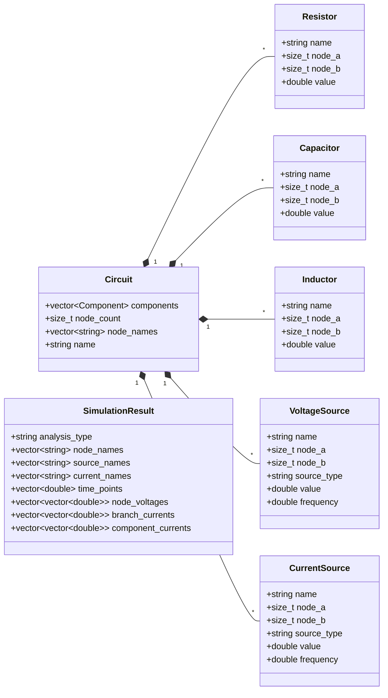
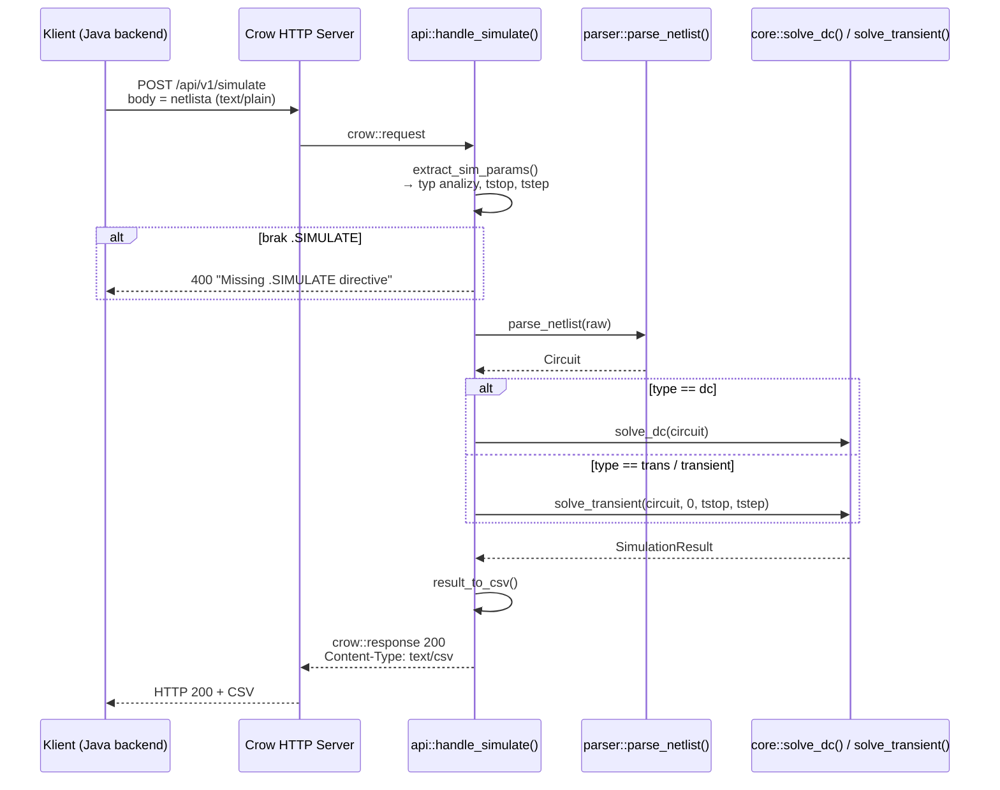

# Silnik symulacji obwodów - dokumentacja (wersja v1.0)

## 1. Przegląd

Napisany w C++23 realizuje numeryczną symulację obwodów elektrycznych metodą **Modified Nodal Analysis (MNA)**.  
Udostępnia jedno HTTP API (Crow), przyjmuje **netlistę** w body żądania POST i zwraca wyniki w formacie **CSV**.

| Cecha | Wartość |
|---|---|
| Język / standard | C++23 |
| Serwer HTTP | Crow 1.2 |
| Algebra liniowa | Eigen 3.4 |
| Port domyślny | `8081` |
| Endpoint | `POST /api/v1/simulate` |

---

## 2. Struktura modułów

```
src/
├── main.cpp                        # punkt wejścia, konfiguracja Crow
├── api/
│   ├── handlers.hpp/.cpp           # obsługa żądania HTTP, ekstrakcja parametrów, serializacja CSV
├── parser/
│   ├── netlist_parser.hpp/.cpp     # parsowanie netlisty
├── core/
│   ├── types.hpp                   # definicje komponentów (Resistor, Capacitor, …)
│   ├── circuit.hpp                 # struktura Circuit (wektor komponentów + węzły)
│   ├── solver.hpp/.cpp             # solver MNA: solve_dc(), solve_transient()
└── utils/
    ├── logger.hpp/.cpp             # singleton loggera z kolorowaniem i thread-safety
```

---

## 3. Diagram klas (UML)



> Typ `Component` to `std::variant<Resistor, Capacitor, Inductor, VoltageSource, CurrentSource>`.

---

## 4. Przepływ informacji (diagram sekwencji)



---

## 5. Wejście

Netlista to wieloliniowy string przesyłany w body żądania POST.

### Reguły
- Jedna linia = jeden komponent: `TYP NAZWA WĘZEŁ_A WĘZEŁ_B [klucz=wartość …]`
- Wielkość liter nie ma znaczenia.
- Linie zaczynające się od `*` - komentarze (ignorowane).
- Linie zaczynające się od `.` - dyrektywy (`.SIMULATE`).
- Węzeł `0` = masa (GND), pomijany w wynikach.

### Obsługiwane komponenty

| Typ | Parametry wymagane | Opcjonalne |
|---|---|---|
| `RES` | `val` (Ω) | — |
| `CAP` | `val` (F) | — |
| `IND` | `val` (H) | — |
| `VSRC` | `val` (V) | `type` (dc/sine), `freq` (Hz) |
| `ISRC` | `val` (A) | `type` (dc/sine), `freq` (Hz) |

### Dyrektywa symulacji

```
.SIMULATE type=dc
.SIMULATE type=trans tstop=0.01 tstep=0.0001
```

Dyrektywa `.SIMULATE` jest **wymagana** - jej brak zwraca HTTP 400.

---

## 6. Wyjście

Odpowiedź HTTP 200 z nagłówkiem `Content-Type: text/csv; charset=utf-8`.

### Struktura kolumn

| Kolumna | Format | Opis |
|---|---|---|
| 1 | `time` | Czas w sekundach (DC → `0.000000`) |
| 2..N | `V(nazwa_węzła)` | Napięcie węzła względem masy |
| N+1..M | `I(nazwa_komponentu)` | Prąd przez komponent (wszystkie, w kolejności netlisty) |

### Przykład (dzielnik napięcia, DC)

```csv
time,V(IN),V(OUT),I(V1),I(R1),I(R2)
0.000000,5.000000,2.500000,-0.002500,0.002500,0.002500
```

---

## 7. Kody błędów HTTP

| Kod | Kiedy |
|---|---|
| **200** | Symulacja zakończona sukcesem + CSV |
| **400** | Pusta netlista, brak `.SIMULATE`, błąd składni, macierz osobliwa |

Ciało odpowiedzi błędnej to `text/plain` z opisem problemu.

---

## 8. Solver MNA - mechanizm

1. **Budowa macierzy MNA** (`A·x = b`):
   - Rezystory - stemplowanie konduktancji `G = 1/R` w macierzy `A`.
   - Źródła napięciowe - dodatkowe wiersze/kolumny w `A` (zmienne prądowe).
   - Źródła prądowe - stemplowanie w wektorze `b`.
   - Cewki (DC) - traktowane jak zwarcie (dodatkowy wiersz, `V = 0`).
   - Kondensatory (DC) - traktowane jak rozwarcie (pomijane).

2. **Rozwiązanie układu** - dekompozycja QR (Eigen: `ColPivHouseholderQR`).  
   Jeśli macierz jest osobliwa = wyjątek z diagnostyką (zwarcie źródeł, węzeł pływający, brak masy).

3. **Analiza transient** - metoda Eulera wstecznego (Backward Euler):
   - Kondensator = zastępczy rezystor `G_c = C/Δt` + źródło prądowe historii.
   - Cewka - zastępczy rezystor `G_l = Δt/L` + źródło prądowe historii.
   - Układ rozwiązywany iteracyjnie dla każdego kroku czasowego.

---

## 9. Budowanie

Zależności pobierane automatycznie przez CMake `FetchContent`:
- **Crow** 1.2 (HTTP)
- **Asio** 1.30 (sieć, wymagane przez Crow)
- **Eigen** 3.4 (algebra liniowa)
